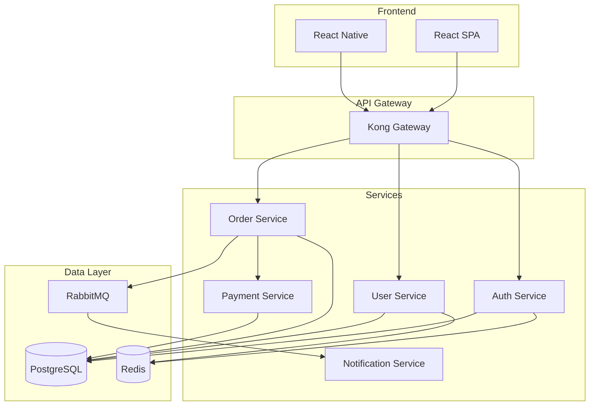
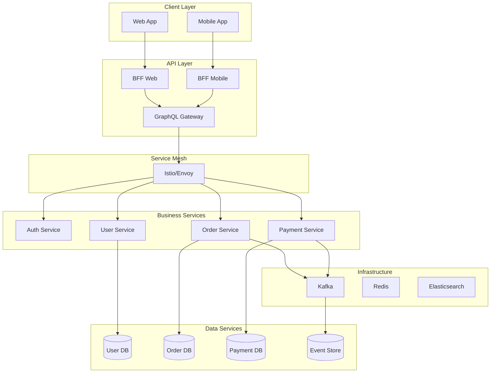

# /architecture-review

Comprehensive architecture analysis and recommendations.

## Usage

```
/architecture-review [scope] [options]
```

## Scopes

- `microservices` - Analyze service architecture
- `monolith` - Review monolithic application
- `serverless` - Serverless architecture review
- `full-stack` - Complete system architecture
- `data` - Data architecture and flow

## Options

- `--patterns` - Identify design patterns
- `--anti-patterns` - Find architectural anti-patterns
- `--scalability` - Analyze scaling capabilities
- `--security` - Security architecture review
- `--cost` - Cost optimization analysis
- `--migration-path` - Suggest migration strategies

## What it does

1. **Analyzes current architecture** across all layers
2. **Identifies patterns** and anti-patterns
3. **Evaluates quality attributes** (scalability, security, performance)
4. **Suggests improvements** with migration paths
5. **Generates architecture documentation** and diagrams

## Example Output

````markdown
## Architecture Review Report

### 🏗️ System Overview

**Architecture Style**: Microservices (partial)
**Deployment**: Kubernetes on AWS
**Database**: PostgreSQL (monolithic)
**Communication**: REST + Message Queue

### 📐 Architecture Diagram


````

### ✅ Architectural Strengths

1. **Service Isolation**: Core services properly isolated
2. **API Gateway**: Centralized entry point with rate limiting
3. **Caching Strategy**: Redis effectively used for sessions
4. **Message Queue**: Async processing for notifications

### 🔴 Critical Issues

#### 1. Database Coupling

**Issue**: All services share single database
**Impact**: No true service independence
**Risk**: Single point of failure

**Solution**:

```yaml
Migration Plan:
  Phase 1: Extract service-specific schemas
  Phase 2: Implement database-per-service
  Phase 3: Add event sourcing for sync

Timeline: 3 months
Effort: 240 hours
```

#### 2. Missing Service Mesh

**Issue**: Direct service-to-service communication
**Impact**: No circuit breaking, difficult debugging

**Solution**: Implement Istio service mesh

```yaml
apiVersion: networking.istio.io/v1beta1
kind: VirtualService
metadata:
  name: order-service
spec:
  http:
    - timeout: 30s
      retries:
        attempts: 3
        perTryTimeout: 10s
```

### 🎯 Design Patterns Identified

| Pattern         | Location     | Status     | Notes                            |
| --------------- | ------------ | ---------- | -------------------------------- |
| API Gateway     | Kong         | ✅ Good    | Well implemented                 |
| Circuit Breaker | -            | ❌ Missing | Need Hystrix/Istio               |
| CQRS            | -            | ❌ Missing | Would benefit Order service      |
| Event Sourcing  | -            | ⚠️ Partial | Only in audit logs               |
| Saga Pattern    | Payment flow | ✅ Good    | Handles distributed transactions |
| Bulkhead        | -            | ❌ Missing | No resource isolation            |

### 🚫 Anti-Patterns Detected

1. **Distributed Monolith**

   - Services too tightly coupled
   - Synchronous communication everywhere
   - Fix: Implement event-driven architecture

2. **Chatty Services**

   - Order service makes 15+ calls per request
   - Fix: Implement BFF pattern or GraphQL

3. **Missing Health Checks**
   - No standardized health endpoints
   - Fix: Implement /health and /ready endpoints

### 📊 Quality Attributes Analysis

| Attribute       | Score | Target | Gap | Priority |
| --------------- | ----- | ------ | --- | -------- |
| Scalability     | 6/10  | 9/10   | -3  | High     |
| Reliability     | 7/10  | 9/10   | -2  | High     |
| Security        | 8/10  | 9/10   | -1  | Medium   |
| Performance     | 6/10  | 8/10   | -2  | High     |
| Maintainability | 5/10  | 8/10   | -3  | Critical |
| Testability     | 4/10  | 8/10   | -4  | Critical |

### 🔄 Recommended Architecture



### 💰 Cost Analysis

**Current Monthly Cost**: $8,450
**Optimized Cost**: $5,200 (-38%)

**Optimization Opportunities**:

1. Right-size Kubernetes nodes (-$1,200)
2. Implement auto-scaling (-$800)
3. Move to Spot instances (-$650)
4. Optimize database instances (-$600)

### 📋 Migration Roadmap

#### Phase 1: Foundation (Month 1-2)

- [ ] Implement service mesh
- [ ] Add distributed tracing
- [ ] Standardize service contracts
- [ ] Set up API versioning

#### Phase 2: Decoupling (Month 3-4)

- [ ] Separate databases
- [ ] Implement event sourcing
- [ ] Add saga orchestration
- [ ] Migration to async communication

#### Phase 3: Optimization (Month 5-6)

- [ ] Implement CQRS
- [ ] Add GraphQL layer
- [ ] Optimize service boundaries
- [ ] Performance tuning

### 🛠️ Implementation Priority

1. **Immediate** (Sprint 24)

   - Add health checks to all services
   - Implement circuit breakers
   - Set up distributed tracing

2. **Short-term** (Q2)

   - Database separation
   - Service mesh deployment
   - API versioning

3. **Long-term** (Q3-Q4)
   - Full event-driven architecture
   - CQRS implementation
   - Complete microservices migration

````

## Implementation

```typescript
async function reviewArchitecture(scope: string, options: ArchitectureOptions) {
  // Analyze current architecture
  const current = await analyzeCurrentArchitecture(scope);

  // Identify patterns and issues
  const analysis = await invokeAgent('solution-architect', {
    task: 'review-architecture',
    architecture: current,
    checkPatterns: options.patterns,
    checkAntiPatterns: options.antiPatterns
  });

  // Generate recommendations
  const recommendations = await invokeAgent('aws-architect', {
    task: 'suggest-improvements',
    analysis: analysis,
    constraints: options
  });

  // Create migration plan if requested
  if (options.migrationPath) {
    const migration = await createMigrationPlan(recommendations);
    return { analysis, recommendations, migration };
  }

  return { analysis, recommendations };
}
````

## Related Commands

- `/tech-debt` - Technical debt analysis
- `/microservices-split` - Monolith decomposition
- `/cloud-migration` - Cloud migration planning
