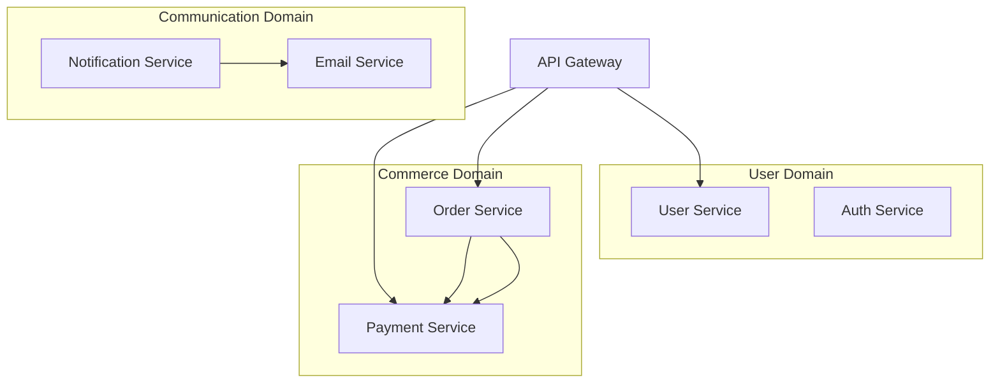

# /blog-post

Create engaging, SEO-optimized blog posts with comprehensive research and audience targeting.

## Usage

```
/blog-post [topic] [options]
```

## Topics

- `technical` - Technical tutorials and how-to guides
- `thought-leadership` - Industry insights and expert opinions
- `product` - Product features, updates, and use cases
- `educational` - Learning resources and explainers
- `news` - Industry news analysis and commentary
- `case-study` - Customer success stories and examples

## Options

- `--audience <level>` - Target audience (beginner|intermediate|advanced|executive)
- `--length <words>` - Approximate word count (default: 1500)
- `--keywords <terms>` - Primary keywords for SEO optimization
- `--tone <style>` - Writing tone (professional|conversational|authoritative|friendly)
- `--series <name>` - Part of content series
- `--cta <action>` - Call-to-action focus (subscribe|download|signup|contact)
- `--research` - Include comprehensive research phase
- `--outline-only` - Generate outline for review before writing

## What it does

1. **Researches topic** comprehensively with current data
2. **Analyzes target audience** and competitive content
3. **Develops SEO strategy** with keyword integration
4. **Creates compelling outline** with logical flow
5. **Writes engaging content** optimized for readability
6. **Optimizes for search** with meta descriptions and headers
7. **Generates social snippets** for distribution

## Example Output

````markdown
## Blog Post: "Building Scalable Microservices with Go and Kubernetes"

**Target Audience**: Intermediate developers
**Estimated Reading Time**: 8-10 minutes
**Primary Keywords**: microservices architecture, Go microservices, Kubernetes deployment
**Publication Date**: March 15, 2024

### SEO Metadata

**Title**: How to Build Scalable Microservices with Go and Kubernetes: A Complete Guide
**Meta Description**: Learn to build production-ready microservices using Go and Kubernetes. Includes architecture patterns, deployment strategies, and performance optimization tips.
**Keywords**: microservices, Go, Kubernetes, scalability, containerization, DevOps

---

# How to Build Scalable Microservices with Go and Kubernetes: A Complete Guide

Modern applications demand scalability, reliability, and maintainability at unprecedented levels. As organizations grow from monolithic architectures to distributed systems, microservices have emerged as the de facto solution for building resilient, scalable applications.

In this comprehensive guide, we'll explore how to architect, build, and deploy production-ready microservices using Go's simplicity and performance combined with Kubernetes' orchestration power.

## Table of Contents

1. [Why Go and Kubernetes for Microservices?](#why-go-kubernetes)
2. [Designing Your Microservices Architecture](#architecture-design)
3. [Building Your First Go Microservice](#building-microservice)
4. [Containerizing with Docker](#containerization)
5. [Kubernetes Deployment and Orchestration](#kubernetes-deployment)
6. [Service Communication and API Gateway](#service-communication)
7. [Monitoring, Logging, and Observability](#observability)
8. [Performance Optimization and Scaling](#performance)
9. [Security Best Practices](#security)
10. [Production Deployment Checklist](#deployment-checklist)

## Why Go and Kubernetes for Microservices? {#why-go-kubernetes}

### The Go Advantage

Go (Golang) has become synonymous with microservices development, and for good reason:

**🚀 Performance**: Go's compiled nature delivers exceptional performance with minimal resource overhead. Unlike interpreted languages, Go applications start instantly and consume significantly less memory.

**⚡ Concurrency**: Go's goroutines and channels make handling thousands of concurrent requests natural and efficient. A single Go service can easily handle 10,000+ concurrent connections.

**🔧 Simplicity**: Go's minimalist design philosophy means less cognitive overhead. Your team can focus on business logic rather than language complexity.

```go
// Simple HTTP server handling concurrent requests
func main() {
    http.HandleFunc("/health", func(w http.ResponseWriter, r *http.Request) {
        w.WriteHeader(http.StatusOK)
        json.NewEncoder(w).Encode(map[string]string{"status": "healthy"})
    })

    log.Fatal(http.ListenAndServe(":8080", nil))
}
```

### Kubernetes Orchestration Benefits

Kubernetes provides the infrastructure backbone that makes microservices management feasible:

- **Auto-scaling**: Automatically adjust service instances based on demand
- **Service Discovery**: Built-in DNS and load balancing between services
- **Rolling Updates**: Zero-downtime deployments with automatic rollback
- **Health Monitoring**: Automatic restart of failed containers
- **Resource Management**: Efficient CPU and memory allocation

> **Real-world Impact**: Companies like Uber report handling 40M+ requests per minute using Go microservices orchestrated by Kubernetes.

## Designing Your Microservices Architecture {#architecture-design}

### Domain-Driven Design Principles

Before writing a single line of code, proper architectural planning prevents future headaches:



### Service Boundaries

**✅ Well-designed boundaries:**

- User Management (authentication, profiles, preferences)
- Product Catalog (inventory, search, recommendations)
- Order Processing (cart, checkout, fulfillment)
- Payment Processing (transactions, billing, refunds)

**❌ Common boundary mistakes:**

- Shared databases between services
- Too many inter-service dependencies
- Services that are too small (nano-services)

### Data Management Strategy

Each microservice should own its data completely:

```go
type UserService struct {
    db *sql.DB // Private database connection
}

type User struct {
    ID       string    `json:"id" db:"id"`
    Email    string    `json:"email" db:"email"`
    Name     string    `json:"name" db:"name"`
    Created  time.Time `json:"created" db:"created_at"`
}

func (us *UserService) GetUser(id string) (*User, error) {
    // Service owns its data access patterns
    query := "SELECT id, email, name, created_at FROM users WHERE id = $1"
    user := &User{}
    err := us.db.QueryRow(query, id).Scan(&user.ID, &user.Email, &user.Name, &user.Created)
    return user, err
}
```

## Building Your First Go Microservice {#building-microservice}

### Project Structure

Organize your Go microservice for maintainability and testability:

```
user-service/
├── cmd/
│   └── server/
│       └── main.go          # Application entry point
├── internal/
│   ├── config/
│   │   └── config.go        # Configuration management
│   ├── handlers/
│   │   └── users.go         # HTTP handlers
│   ├── models/
│   │   └── user.go          # Data models
│   ├── repository/
│   │   └── postgres.go      # Data access layer
│   └── service/
│       └── user_service.go  # Business logic
├── pkg/
│   └── middleware/
│       └── auth.go          # Shared middleware
├── deployments/
│   ├── Dockerfile
│   └── k8s/
│       ├── deployment.yaml
│       └── service.yaml
└── go.mod
```

### Core Service Implementation

```go
// internal/service/user_service.go
package service

import (
    "context"
    "errors"
    "log/slog"

    "github.com/google/uuid"
    "user-service/internal/models"
    "user-service/internal/repository"
)

type UserService struct {
    repo   repository.UserRepository
    logger *slog.Logger
}

func NewUserService(repo repository.UserRepository, logger *slog.Logger) *UserService {
    return &UserService{
        repo:   repo,
        logger: logger,
    }
}

func (s *UserService) CreateUser(ctx context.Context, req *models.CreateUserRequest) (*models.User, error) {
    // Input validation
    if err := req.Validate(); err != nil {
        s.logger.Warn("Invalid user creation request", "error", err)
        return nil, errors.New("invalid request")
    }

    // Business logic
    user := &models.User{
        ID:    uuid.New().String(),
        Email: req.Email,
        Name:  req.Name,
    }

    // Persistence
    if err := s.repo.Create(ctx, user); err != nil {
        s.logger.Error("Failed to create user", "error", err, "email", req.Email)
        return nil, err
    }

    s.logger.Info("User created successfully", "user_id", user.ID, "email", user.Email)
    return user, nil
}

func (s *UserService) GetUser(ctx context.Context, id string) (*models.User, error) {
    if id == "" {
        return nil, errors.New("user ID required")
    }

    user, err := s.repo.GetByID(ctx, id)
    if err != nil {
        s.logger.Error("Failed to get user", "error", err, "user_id", id)
        return nil, err
    }

    return user, nil
}
```

### HTTP Handler Layer

```go
// internal/handlers/users.go
package handlers

import (
    "encoding/json"
    "net/http"

    "github.com/gorilla/mux"
    "user-service/internal/service"
)

type UserHandler struct {
    service *service.UserService
}

func NewUserHandler(service *service.UserService) *UserHandler {
    return &UserHandler{service: service}
}

func (h *UserHandler) CreateUser(w http.ResponseWriter, r *http.Request) {
    var req models.CreateUserRequest
    if err := json.NewDecoder(r.Body).Decode(&req); err != nil {
        http.Error(w, "Invalid JSON", http.StatusBadRequest)
        return
    }

    user, err := h.service.CreateUser(r.Context(), &req)
    if err != nil {
        http.Error(w, err.Error(), http.StatusInternalServerError)
        return
    }

    w.Header().Set("Content-Type", "application/json")
    w.WriteHeader(http.StatusCreated)
    json.NewEncoder(w).Encode(user)
}

func (h *UserHandler) GetUser(w http.ResponseWriter, r *http.Request) {
    vars := mux.Vars(r)
    id := vars["id"]

    user, err := h.service.GetUser(r.Context(), id)
    if err != nil {
        http.Error(w, err.Error(), http.StatusNotFound)
        return
    }

    w.Header().Set("Content-Type", "application/json")
    json.NewEncoder(w).Encode(user)
}

// RegisterRoutes sets up HTTP routes
func (h *UserHandler) RegisterRoutes(router *mux.Router) {
    router.HandleFunc("/users", h.CreateUser).Methods("POST")
    router.HandleFunc("/users/{id}", h.GetUser).Methods("GET")
    router.HandleFunc("/users/{id}", h.UpdateUser).Methods("PUT")
    router.HandleFunc("/users/{id}", h.DeleteUser).Methods("DELETE")

    // Health check endpoint
    router.HandleFunc("/health", h.HealthCheck).Methods("GET")
}
```

## Containerizing with Docker {#containerization}

### Multi-stage Dockerfile

Create efficient, secure container images:

```dockerfile
# Build stage
FROM golang:1.21-alpine AS builder

WORKDIR /app

# Copy go mod files
COPY go.mod go.sum ./
RUN go mod download

# Copy source code
COPY . .

# Build the application
RUN CGO_ENABLED=0 GOOS=linux go build -a -installsuffix cgo -o main cmd/server/main.go

# Final stage
FROM alpine:latest

RUN apk --no-cache add ca-certificates tzdata

WORKDIR /root/

# Copy the binary from builder stage
COPY --from=builder /app/main .
COPY --from=builder /app/deployments/config.yaml .

# Create non-root user
RUN addgroup -g 1001 -S appgroup && \
    adduser -u 1001 -S appuser -G appgroup

USER appuser

EXPOSE 8080

CMD ["./main"]
```

### Container Best Practices

**🔒 Security**:

```dockerfile
# Use specific versions
FROM golang:1.21.5-alpine AS builder

# Run as non-root user
RUN adduser -D -s /bin/sh appuser
USER appuser

# Use minimal base image
FROM scratch
```

**⚡ Performance**:

```dockerfile
# Multi-stage builds reduce image size
FROM alpine:latest  # 5MB vs ubuntu:latest 64MB

# Copy only necessary files
COPY --from=builder /app/main .

# Optimize layer caching
COPY go.mod go.sum ./
RUN go mod download  # This layer cached until dependencies change
```

## Kubernetes Deployment and Orchestration {#kubernetes-deployment}

### Deployment Configuration

```yaml
# deployments/k8s/deployment.yaml
apiVersion: apps/v1
kind: Deployment
metadata:
  name: user-service
  labels:
    app: user-service
    version: v1.0.0
spec:
  replicas: 3
  selector:
    matchLabels:
      app: user-service
  template:
    metadata:
      labels:
        app: user-service
        version: v1.0.0
    spec:
      containers:
        - name: user-service
          image: your-registry/user-service:v1.0.0
          ports:
            - containerPort: 8080
              protocol: TCP
          env:
            - name: DATABASE_URL
              valueFrom:
                secretKeyRef:
                  name: user-service-secrets
                  key: database-url
            - name: LOG_LEVEL
              value: "info"
          resources:
            requests:
              memory: "128Mi"
              cpu: "100m"
            limits:
              memory: "256Mi"
              cpu: "200m"
          livenessProbe:
            httpGet:
              path: /health
              port: 8080
            initialDelaySeconds: 30
            periodSeconds: 10
          readinessProbe:
            httpGet:
              path: /health
              port: 8080
            initialDelaySeconds: 5
            periodSeconds: 5
      imagePullSecrets:
        - name: registry-secret
```

### Service and Ingress

```yaml
# deployments/k8s/service.yaml
apiVersion: v1
kind: Service
metadata:
  name: user-service
  labels:
    app: user-service
spec:
  selector:
    app: user-service
  ports:
    - port: 80
      targetPort: 8080
      protocol: TCP
  type: ClusterIP

---
apiVersion: networking.k8s.io/v1
kind: Ingress
metadata:
  name: user-service-ingress
  annotations:
    kubernetes.io/ingress.class: nginx
    cert-manager.io/cluster-issuer: letsencrypt-prod
    nginx.ingress.kubernetes.io/rate-limit: "100"
spec:
  tls:
    - hosts:
        - api.yourcompany.com
      secretName: api-tls
  rules:
    - host: api.yourcompany.com
      http:
        paths:
          - path: /users
            pathType: Prefix
            backend:
              service:
                name: user-service
                port:
                  number: 80
```

### Auto-scaling Configuration

```yaml
# deployments/k8s/hpa.yaml
apiVersion: autoscaling/v2
kind: HorizontalPodAutoscaler
metadata:
  name: user-service-hpa
spec:
  scaleTargetRef:
    apiVersion: apps/v1
    kind: Deployment
    name: user-service
  minReplicas: 3
  maxReplicas: 20
  metrics:
    - type: Resource
      resource:
        name: cpu
        target:
          type: Utilization
          averageUtilization: 70
    - type: Resource
      resource:
        name: memory
        target:
          type: Utilization
          averageUtilization: 80
```

## Service Communication and API Gateway {#service-communication}

### Service-to-Service Communication

**Synchronous Communication** (HTTP/gRPC):

```go
// internal/client/product_client.go
type ProductClient struct {
    baseURL    string
    httpClient *http.Client
}

func (pc *ProductClient) GetProduct(ctx context.Context, productID string) (*Product, error) {
    req, err := http.NewRequestWithContext(
        ctx,
        "GET",
        fmt.Sprintf("%s/products/%s", pc.baseURL, productID),
        nil,
    )
    if err != nil {
        return nil, err
    }

    // Add service authentication
    req.Header.Set("Authorization", "Bearer " + pc.getServiceToken())
    req.Header.Set("X-Service-Name", "user-service")

    resp, err := pc.httpClient.Do(req)
    if err != nil {
        return nil, err
    }
    defer resp.Body.Close()

    if resp.StatusCode != http.StatusOK {
        return nil, fmt.Errorf("product service error: %d", resp.StatusCode)
    }

    var product Product
    if err := json.NewDecoder(resp.Body).Decode(&product); err != nil {
        return nil, err
    }

    return &product, nil
}
```

**Asynchronous Communication** (Message Queues):

```go
// internal/messaging/publisher.go
type EventPublisher struct {
    client redis.Client
}

type UserCreatedEvent struct {
    UserID    string    `json:"user_id"`
    Email     string    `json:"email"`
    Name      string    `json:"name"`
    CreatedAt time.Time `json:"created_at"`
}

func (ep *EventPublisher) PublishUserCreated(ctx context.Context, event UserCreatedEvent) error {
    data, err := json.Marshal(event)
    if err != nil {
        return err
    }

    return ep.client.Publish(ctx, "user.created", data).Err()
}

// In your service layer
func (s *UserService) CreateUser(ctx context.Context, req *models.CreateUserRequest) (*models.User, error) {
    user, err := s.repo.Create(ctx, user)
    if err != nil {
        return nil, err
    }

    // Publish event asynchronously
    go func() {
        event := UserCreatedEvent{
            UserID:    user.ID,
            Email:     user.Email,
            Name:      user.Name,
            CreatedAt: user.CreatedAt,
        }

        if err := s.eventPublisher.PublishUserCreated(context.Background(), event); err != nil {
            s.logger.Error("Failed to publish user created event", "error", err)
        }
    }()

    return user, nil
}
```

### API Gateway Integration

```yaml
# API Gateway configuration (Kong/Ambassador/Istio)
apiVersion: networking.istio.io/v1alpha3
kind: VirtualService
metadata:
  name: microservices-api
spec:
  http:
    - match:
        - uri:
            prefix: /api/v1/users
      rewrite:
        uri: /users
      route:
        - destination:
            host: user-service
            port:
              number: 80
          weight: 100
      timeout: 30s
      retries:
        attempts: 3
        perTryTimeout: 10s
    - match:
        - uri:
            prefix: /api/v1/products
      route:
        - destination:
            host: product-service
            port:
              number: 80
```

## Monitoring, Logging, and Observability {#observability}

### Structured Logging

```go
// internal/logging/logger.go
import (
    "log/slog"
    "os"
)

func NewLogger() *slog.Logger {
    opts := &slog.HandlerOptions{
        Level: slog.LevelInfo,
    }

    handler := slog.NewJSONHandler(os.Stdout, opts)
    logger := slog.New(handler)

    return logger
}

// Usage in service
func (s *UserService) CreateUser(ctx context.Context, req *models.CreateUserRequest) (*models.User, error) {
    // Structured logging with context
    s.logger.InfoContext(ctx, "Creating user",
        slog.String("email", req.Email),
        slog.String("request_id", getRequestID(ctx)),
        slog.String("service", "user-service"),
        slog.String("operation", "create_user"),
    )

    user, err := s.repo.Create(ctx, user)
    if err != nil {
        s.logger.ErrorContext(ctx, "Failed to create user",
            slog.String("error", err.Error()),
            slog.String("email", req.Email),
        )
        return nil, err
    }

    s.logger.InfoContext(ctx, "User created successfully",
        slog.String("user_id", user.ID),
        slog.Duration("duration", time.Since(start)),
    )

    return user, nil
}
```

### Metrics with Prometheus

```go
// internal/metrics/metrics.go
import (
    "github.com/prometheus/client_golang/prometheus"
    "github.com/prometheus/client_golang/prometheus/promauto"
)

var (
    httpRequestDuration = promauto.NewHistogramVec(
        prometheus.HistogramOpts{
            Name: "http_request_duration_seconds",
            Help: "Duration of HTTP requests in seconds",
        },
        []string{"method", "endpoint", "status_code"},
    )

    activeUsers = promauto.NewGauge(
        prometheus.GaugeOpts{
            Name: "active_users_total",
            Help: "Total number of active users",
        },
    )

    userCreationTotal = promauto.NewCounterVec(
        prometheus.CounterOpts{
            Name: "user_creation_total",
            Help: "Total number of user creation attempts",
        },
        []string{"status"},
    )
)

// Middleware for HTTP metrics
func MetricsMiddleware(next http.Handler) http.Handler {
    return http.HandlerFunc(func(w http.ResponseWriter, r *http.Request) {
        start := time.Now()

        // Wrap response writer to capture status code
        ww := &responseWriter{ResponseWriter: w, statusCode: http.StatusOK}

        next.ServeHTTP(ww, r)

        duration := time.Since(start).Seconds()
        httpRequestDuration.WithLabelValues(
            r.Method,
            r.URL.Path,
            fmt.Sprintf("%d", ww.statusCode),
        ).Observe(duration)
    })
}
```

### Distributed Tracing

```go
// internal/tracing/tracer.go
import (
    "go.opentelemetry.io/otel"
    "go.opentelemetry.io/otel/trace"
)

func (s *UserService) CreateUser(ctx context.Context, req *models.CreateUserRequest) (*models.User, error) {
    // Start trace span
    tracer := otel.Tracer("user-service")
    ctx, span := tracer.Start(ctx, "UserService.CreateUser")
    defer span.End()

    // Add trace attributes
    span.SetAttributes(
        attribute.String("user.email", req.Email),
        attribute.String("operation", "create_user"),
    )

    // Validate request
    if err := req.Validate(); err != nil {
        span.RecordError(err)
        span.SetStatus(codes.Error, "validation failed")
        return nil, err
    }

    // Create user with trace context
    user, err := s.repo.Create(ctx, user)
    if err != nil {
        span.RecordError(err)
        span.SetStatus(codes.Error, "database operation failed")
        return nil, err
    }

    span.SetAttributes(attribute.String("user.id", user.ID))
    span.SetStatus(codes.Ok, "user created successfully")

    return user, nil
}
```

## Performance Optimization and Scaling {#performance}

### Connection Pooling and Database Optimization

```go
// internal/database/postgres.go
import (
    "database/sql"
    "time"

    _ "github.com/lib/pq"
)

func NewPostgresDB(databaseURL string) (*sql.DB, error) {
    db, err := sql.Open("postgres", databaseURL)
    if err != nil {
        return nil, err
    }

    // Connection pool optimization
    db.SetMaxOpenConns(25)                 // Maximum open connections
    db.SetMaxIdleConns(25)                 // Maximum idle connections
    db.SetConnMaxLifetime(5 * time.Minute) // Connection lifetime
    db.SetConnMaxIdleTime(1 * time.Minute) // Idle connection timeout

    return db, nil
}
```

### Caching Strategy

```go
// internal/cache/redis_cache.go
type CacheService struct {
    client redis.Client
    ttl    time.Duration
}

func (cs *CacheService) GetUser(ctx context.Context, userID string) (*models.User, error) {
    // Try cache first
    key := fmt.Sprintf("user:%s", userID)
    cached, err := cs.client.Get(ctx, key).Result()
    if err == nil {
        var user models.User
        if err := json.Unmarshal([]byte(cached), &user); err == nil {
            return &user, nil
        }
    }

    // Cache miss - get from database
    user, err := cs.repo.GetByID(ctx, userID)
    if err != nil {
        return nil, err
    }

    // Cache the result asynchronously
    go func() {
        if data, err := json.Marshal(user); err == nil {
            cs.client.Set(context.Background(), key, data, cs.ttl)
        }
    }()

    return user, nil
}
```

### Circuit Breaker Pattern

```go
// internal/circuit/breaker.go
import "github.com/sony/gobreaker"

type ProductServiceClient struct {
    breaker *gobreaker.CircuitBreaker
    client  *http.Client
}

func NewProductServiceClient() *ProductServiceClient {
    settings := gobreaker.Settings{
        Name:        "product-service",
        MaxRequests: 3,
        Interval:    10 * time.Second,
        Timeout:     60 * time.Second,
        ReadyToTrip: func(counts gobreaker.Counts) bool {
            failureRatio := float64(counts.TotalFailures) / float64(counts.Requests)
            return counts.Requests >= 3 && failureRatio >= 0.6
        },
    }

    return &ProductServiceClient{
        breaker: gobreaker.NewCircuitBreaker(settings),
        client:  &http.Client{Timeout: 10 * time.Second},
    }
}

func (psc *ProductServiceClient) GetProduct(ctx context.Context, id string) (*Product, error) {
    result, err := psc.breaker.Execute(func() (interface{}, error) {
        return psc.makeHTTPRequest(ctx, id)
    })

    if err != nil {
        // Return cached data or default response
        return psc.getProductFallback(id), nil
    }

    return result.(*Product), nil
}
```

## Security Best Practices {#security}

### Authentication and Authorization

```go
// internal/auth/middleware.go
func AuthMiddleware(tokenValidator TokenValidator) func(http.Handler) http.Handler {
    return func(next http.Handler) http.Handler {
        return http.HandlerFunc(func(w http.ResponseWriter, r *http.Request) {
            authHeader := r.Header.Get("Authorization")
            if authHeader == "" {
                http.Error(w, "Missing authorization header", http.StatusUnauthorized)
                return
            }

            token := strings.TrimPrefix(authHeader, "Bearer ")
            claims, err := tokenValidator.ValidateToken(token)
            if err != nil {
                http.Error(w, "Invalid token", http.StatusUnauthorized)
                return
            }

            // Add user context to request
            ctx := context.WithValue(r.Context(), "user_id", claims.UserID)
            ctx = context.WithValue(ctx, "roles", claims.Roles)

            next.ServeHTTP(w, r.WithContext(ctx))
        })
    }
}

// Role-based access control
func RequireRole(role string) func(http.Handler) http.Handler {
    return func(next http.Handler) http.Handler {
        return http.HandlerFunc(func(w http.ResponseWriter, r *http.Request) {
            roles, ok := r.Context().Value("roles").([]string)
            if !ok {
                http.Error(w, "Access denied", http.StatusForbidden)
                return
            }

            for _, userRole := range roles {
                if userRole == role || userRole == "admin" {
                    next.ServeHTTP(w, r)
                    return
                }
            }

            http.Error(w, "Insufficient permissions", http.StatusForbidden)
        })
    }
}
```

### Input Validation and Sanitization

```go
// internal/validation/validator.go
import "github.com/go-playground/validator/v10"

type Validator struct {
    validate *validator.Validate
}

func NewValidator() *Validator {
    return &Validator{
        validate: validator.New(),
    }
}

type CreateUserRequest struct {
    Email    string `json:"email" validate:"required,email,max=255"`
    Name     string `json:"name" validate:"required,min=2,max=100,alpha_space"`
    Password string `json:"password" validate:"required,min=8,max=128,strong_password"`
    Age      int    `json:"age" validate:"min=13,max=120"`
}

func (v *Validator) ValidateStruct(s interface{}) error {
    return v.validate.Struct(s)
}

// Custom validation for strong passwords
func init() {
    validator.New().RegisterValidation("strong_password", func(fl validator.FieldLevel) bool {
        password := fl.Field().String()
        // Must contain uppercase, lowercase, number, and special character
        hasUpper := regexp.MustCompile(`[A-Z]`).MatchString(password)
        hasLower := regexp.MustCompile(`[a-z]`).MatchString(password)
        hasNumber := regexp.MustCompile(`[0-9]`).MatchString(password)
        hasSpecial := regexp.MustCompile(`[!@#$%^&*()_+\-=\[\]{}|;:,.<>?]`).MatchString(password)

        return hasUpper && hasLower && hasNumber && hasSpecial
    })
}
```

### Rate Limiting

```go
// internal/middleware/ratelimit.go
import (
    "golang.org/x/time/rate"
    "sync"
)

type RateLimiter struct {
    limiters map[string]*rate.Limiter
    mu       sync.RWMutex
    rate     rate.Limit
    burst    int
}

func NewRateLimiter(r rate.Limit, burst int) *RateLimiter {
    return &RateLimiter{
        limiters: make(map[string]*rate.Limiter),
        rate:     r,
        burst:    burst,
    }
}

func (rl *RateLimiter) GetLimiter(key string) *rate.Limiter {
    rl.mu.RLock()
    limiter, exists := rl.limiters[key]
    rl.mu.RUnlock()

    if !exists {
        rl.mu.Lock()
        limiter = rate.NewLimiter(rl.rate, rl.burst)
        rl.limiters[key] = limiter
        rl.mu.Unlock()
    }

    return limiter
}

func (rl *RateLimiter) Middleware(next http.Handler) http.Handler {
    return http.HandlerFunc(func(w http.ResponseWriter, r *http.Request) {
        // Rate limit by IP address
        key := getClientIP(r)
        limiter := rl.GetLimiter(key)

        if !limiter.Allow() {
            http.Error(w, "Rate limit exceeded", http.StatusTooManyRequests)
            return
        }

        next.ServeHTTP(w, r)
    })
}
```

## Production Deployment Checklist {#deployment-checklist}

### Pre-deployment Verification

✅ **Code Quality**

- [ ] All tests passing (unit, integration, e2e)
- [ ] Code coverage above threshold (80%+)
- [ ] Security scan completed (no high/critical issues)
- [ ] Dependency audit passed
- [ ] Code review approved by 2+ team members

✅ **Configuration Management**

- [ ] Environment-specific configs validated
- [ ] Secrets properly managed (no hardcoded values)
- [ ] Feature flags configured
- [ ] Database migrations tested
- [ ] Configuration schema validation

✅ **Infrastructure Readiness**

- [ ] Kubernetes cluster health verified
- [ ] Resource quotas and limits configured
- [ ] Monitoring and alerting setup
- [ ] Log aggregation working
- [ ] Backup systems operational

✅ **Performance & Scalability**

- [ ] Load testing completed
- [ ] Auto-scaling policies configured
- [ ] Resource usage within acceptable ranges
- [ ] Database performance optimized
- [ ] CDN and caching configured

### Deployment Strategy

```bash
#!/bin/bash
# deploy.sh - Production deployment script

set -e

# Configuration
SERVICE_NAME="user-service"
IMAGE_TAG="${1:-latest}"
NAMESPACE="production"
TIMEOUT="600s"

echo "🚀 Starting deployment of $SERVICE_NAME:$IMAGE_TAG"

# Pre-deployment checks
echo "🔍 Running pre-deployment checks..."
kubectl cluster-info
kubectl get nodes
kubectl get pods -n $NAMESPACE

# Deploy with rolling update
echo "📦 Deploying $SERVICE_NAME..."
kubectl set image deployment/$SERVICE_NAME \
    $SERVICE_NAME=your-registry/$SERVICE_NAME:$IMAGE_TAG \
    -n $NAMESPACE

# Wait for rollout to complete
echo "⏳ Waiting for rollout to complete..."
kubectl rollout status deployment/$SERVICE_NAME \
    -n $NAMESPACE \
    --timeout=$TIMEOUT

# Post-deployment verification
echo "✅ Verifying deployment health..."
kubectl get pods -n $NAMESPACE -l app=$SERVICE_NAME
kubectl logs -n $NAMESPACE -l app=$SERVICE_NAME --tail=10

# Run smoke tests
echo "🧪 Running smoke tests..."
./scripts/smoke-tests.sh $NAMESPACE

echo "🎉 Deployment completed successfully!"
```

### Monitoring and Alerting

```yaml
# monitoring/alerts.yaml
apiVersion: monitoring.coreos.com/v1
kind: PrometheusRule
metadata:
  name: user-service-alerts
spec:
  groups:
    - name: user-service
      rules:
        - alert: HighErrorRate
          expr: rate(http_requests_total{service="user-service",status=~"5.."}[5m]) > 0.1
          for: 2m
          labels:
            severity: critical
          annotations:
            summary: "High error rate detected in user-service"
            description: "Error rate is {{ $value }} requests per second"

        - alert: HighResponseTime
          expr: histogram_quantile(0.95, rate(http_request_duration_seconds_bucket{service="user-service"}[5m])) > 1
          for: 5m
          labels:
            severity: warning
          annotations:
            summary: "High response time in user-service"
            description: "95th percentile response time is {{ $value }} seconds"

        - alert: PodCrashLooping
          expr: rate(kube_pod_container_status_restarts_total{container="user-service"}[15m]) > 0
          for: 5m
          labels:
            severity: critical
          annotations:
            summary: "User service pod is crash looping"
```

## Conclusion

Building scalable microservices with Go and Kubernetes requires careful attention to architecture, implementation, and operational concerns. The combination of Go's performance and simplicity with Kubernetes' orchestration capabilities provides a robust foundation for modern distributed systems.

### Key Takeaways

1. **Start with proper domain modeling** - Well-defined service boundaries are crucial
2. **Embrace observability** - Comprehensive monitoring, logging, and tracing are non-negotiable
3. **Plan for failure** - Implement circuit breakers, retries, and graceful degradation
4. **Automate everything** - From deployment to scaling to recovery
5. **Security first** - Build security considerations into every layer

### Next Steps

- **Explore advanced patterns**: Event sourcing, CQRS, saga pattern
- **Enhance observability**: Distributed tracing with Jaeger/Zipkin
- **Implement chaos engineering**: Test system resilience with controlled failures
- **Optimize performance**: Profiling, benchmarking, and continuous optimization

Ready to build your microservices architecture? Start with a simple service, apply these patterns gradually, and scale based on actual needs rather than theoretical requirements.

---

_Have questions about implementing these patterns? Join our [Discord community](https://discord.gg/microservices) or check out our [GitHub examples repository](https://github.com/yourcompany/microservices-examples) for complete working code samples._

### Social Media Snippets

**Twitter/X**:
🚀 New guide: Building Scalable Microservices with Go and Kubernetes

✅ Complete architecture walkthrough
✅ Production deployment checklist  
✅ Performance optimization tips
✅ Security best practices

Perfect for teams moving from monoliths to microservices!

#golang #kubernetes #microservices #devops

**LinkedIn**:
Just published a comprehensive guide on building scalable microservices with Go and Kubernetes. This 8,000-word deep dive covers everything from initial architecture decisions to production deployment strategies.

Key highlights:
• Domain-driven design for service boundaries
• Performance optimization with connection pooling and caching
• Security implementation with authentication and rate limiting
• Complete Kubernetes deployment configurations
• Production monitoring and observability setup

Whether you're migrating from a monolith or starting fresh, this guide provides practical, battle-tested patterns that scale.

#golang #kubernetes #microservices #softwarearchitecture #devops

**Meta Description for SEO**:
Learn to build production-ready microservices using Go and Kubernetes. Complete guide covering architecture patterns, deployment strategies, performance optimization, and security best practices with real code examples.

### Related Content Suggestions

- "Microservices vs Monoliths: When to Choose Each Architecture"
- "Advanced Go Patterns for High-Performance Microservices"
- "Kubernetes Security Best Practices for Production Workloads"
- "Monitoring and Observability in Distributed Systems"
- "Database Design Patterns for Microservices"
````

## Implementation

```typescript
async function createBlogPost(topic: string, options: BlogPostOptions) {
  // Research phase
  const research = await invokeAgent("blog-writer", {
    task: "comprehensive-research",
    topic: topic,
    audience: options.audience,
    keywords: options.keywords,
  });

  // Content creation
  const content = await invokeAgent("blog-writer", {
    task: "write-blog-post",
    topic: topic,
    research: research,
    length: options.length,
    tone: options.tone,
    seo: true,
  });

  // SEO optimization
  const seoOptimized = await invokeAgent("marketing-seo-specialist", {
    task: "optimize-content",
    content: content,
    keywords: options.keywords,
    meta: true,
  });

  return { content: seoOptimized, research, socialSnippets: generateSocialSnippets(content) };
}
```

## Related Commands

- `/seo-analyze` - Content SEO analysis and optimization
- `/content-calendar` - Editorial calendar planning
- `/competitor-analysis` - Content competitive analysis
