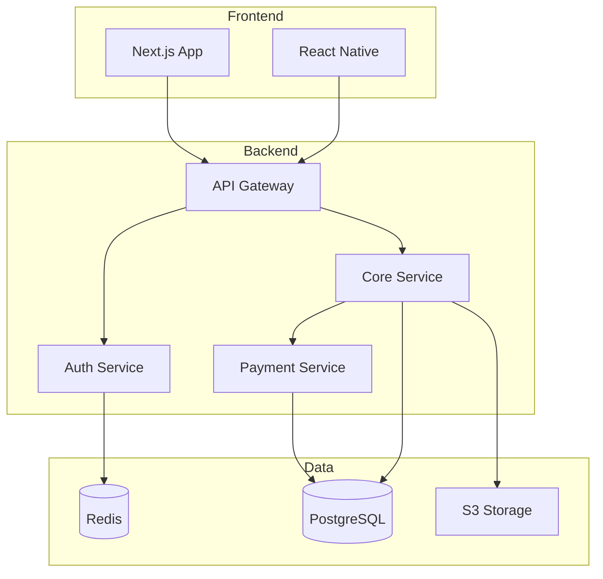
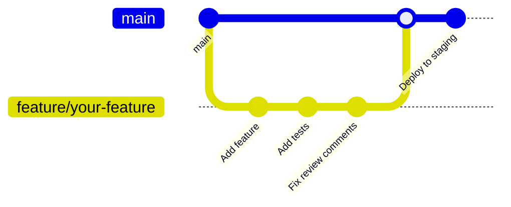

# /onboard-dev

Generate comprehensive onboarding materials for new developers.

## Usage

```
/onboard-dev [role] [options]
```

## Roles

- `frontend` - Frontend developer onboarding
- `backend` - Backend developer onboarding
- `fullstack` - Full-stack developer onboarding
- `devops` - DevOps engineer onboarding
- `mobile` - Mobile developer onboarding

## Options

- `--project <name>` - Specific project focus
- `--seniority junior|mid|senior` - Tailor to experience level
- `--duration <days>` - Onboarding timeline (default: 14)
- `--checklist` - Generate onboarding checklist
- `--buddy <name>` - Assign onboarding buddy
- `--interactive` - Create interactive tutorials

## What it does

1. **Analyzes codebase** and documentation
2. **Creates learning path** based on role and seniority
3. **Generates setup guides** for development environment
4. **Produces project walkthroughs** with examples
5. **Creates onboarding checklist** and timeline

## Example Output

````markdown
## Developer Onboarding Guide

**Role**: Full-Stack Developer
**Seniority**: Mid-Level
**Start Date**: January 15, 2024
**Buddy**: Sarah Chen (@sarah)
**Expected Ramp-up**: 4 weeks

### 🎯 Week 1: Environment & Basics

#### Day 1: Setup & Access

- [ ] **Development Environment**

  ```bash
  # Clone repositories
  git clone git@github.com:company/main-app.git
  git clone git@github.com:company/api-service.git
  git clone git@github.com:company/shared-libs.git

  # Install dependencies
  cd main-app && npm install
  cd ../api-service && npm install

  # Setup local environment
  cp .env.example .env.local
  # Edit .env.local with your credentials
  ```
````

- [ ] **Required Tools**

  ```bash
  # Check installations
  node --version  # Should be v18+
  npm --version   # Should be v9+
  docker --version # Should be v20+

  # Install additional tools
  npm install -g @company/cli-tools
  brew install postgresql redis
  ```

- [ ] **Access Checklist**
  - ✅ GitHub repository access
  - ✅ Slack channels: #dev, #frontend, #backend
  - ✅ Linear/Jira project board
  - ✅ AWS console (read-only initially)
  - ✅ Datadog monitoring dashboard
  - ✅ Documentation wiki

#### Day 2-3: Architecture Overview

**System Architecture**:



**Key Technologies**:
| Layer | Technology | Purpose | Learn More |
|-------|------------|---------|------------|
| Frontend | Next.js 14 | SSR React framework | [Internal Docs](wiki/nextjs) |
| State | Zustand | Client state management | [Examples](examples/state) |
| API | Express + TypeScript | REST API | [API Docs](api-docs) |
| Database | PostgreSQL + Prisma | Data persistence | [Schema](db/schema) |
| Cache | Redis | Session & caching | [Cache Strategy](wiki/cache) |
| Queue | Bull/Redis | Job processing | [Job Docs](wiki/jobs) |

#### Day 4-5: First Code Contribution

**Starter Task**: Add user preferences endpoint
**Ticket**: #DEV-1234
**Estimated Time**: 4 hours

1. **Understand the requirement**

   ```typescript
   // GET /api/users/:id/preferences
   // POST /api/users/:id/preferences
   interface UserPreferences {
     theme: "light" | "dark";
     notifications: {
       email: boolean;
       push: boolean;
     };
     language: string;
   }
   ```

2. **Implementation Steps**

   ```bash
   # Create feature branch
   git checkout -b feature/user-preferences

   # Run tests continuously
   npm run test:watch
   ```

3. **Code Locations**
   - API Route: `src/routes/users.ts`
   - Controller: `src/controllers/UserController.ts`
   - Service: `src/services/UserService.ts`
   - Tests: `src/__tests__/users.test.ts`

### 📚 Week 2: Deep Dive

#### Core Concepts to Master

1. **Authentication Flow**

   - JWT token management
   - Refresh token rotation
   - Permission system (RBAC)
   - [Interactive Tutorial](tutorials/auth)

2. **Data Layer**

   - Prisma ORM basics
   - Migration workflow
   - Query optimization
   - [Database Guide](wiki/database)

3. **Testing Strategy**

   ```typescript
   // Unit Test Example
   describe("UserService", () => {
     it("should update preferences", async () => {
       const result = await userService.updatePreferences(userId, { theme: "dark" });
       expect(result.theme).toBe("dark");
     });
   });

   // Integration Test Example
   describe("POST /api/users/:id/preferences", () => {
     it("should update and return preferences", async () => {
       const res = await request(app)
         .post("/api/users/123/preferences")
         .send({ theme: "dark" })
         .expect(200);

       expect(res.body.theme).toBe("dark");
     });
   });
   ```

#### Development Workflow



**PR Process**:

1. Create feature branch from `main`
2. Make changes with tests
3. Run `npm run pre-commit` (lint, test, type-check)
4. Create PR with template
5. Address review feedback
6. Merge after 2 approvals
7. Auto-deploy to staging

### 🚀 Week 3-4: Project Ownership

#### Your First Project: User Dashboard Redesign

**Responsibilities**:

- Lead frontend implementation
- Coordinate with design team
- Implement API endpoints
- Write comprehensive tests
- Deploy to production

**Learning Goals**:

- [ ] Master component architecture
- [ ] Implement complex state management
- [ ] Optimize performance (Core Web Vitals)
- [ ] Handle production deployment
- [ ] Monitor and debug production issues

### 📋 Onboarding Checklist

#### Technical Setup

- [ ] Local environment running
- [ ] Can run all test suites
- [ ] Database seeded with test data
- [ ] Can build and deploy locally
- [ ] Debugging tools configured

#### Knowledge Transfer

- [ ] Architecture walkthrough with tech lead
- [ ] Database schema review
- [ ] API patterns and conventions
- [ ] Security best practices session
- [ ] Performance optimization techniques

#### Process & Culture

- [ ] Sprint planning attendance
- [ ] First stand-up participation
- [ ] Code review given and received
- [ ] Documentation contribution
- [ ] Team social/coffee chat

#### Milestones

- [ ] Week 1: First PR merged
- [ ] Week 2: Complete starter project
- [ ] Week 3: Own a feature
- [ ] Week 4: Production deployment

### 📖 Essential Documentation

1. **Must Read**

   - [Engineering Handbook](wiki/handbook)
   - [Code Style Guide](wiki/style-guide)
   - [Security Guidelines](wiki/security)
   - [Incident Response](wiki/incidents)

2. **Architecture Docs**

   - [System Design](wiki/system-design)
   - [API Conventions](wiki/api-conventions)
   - [Database Patterns](wiki/db-patterns)
   - [Microservices Communication](wiki/microservices)

3. **Tools & Processes**
   - [CI/CD Pipeline](wiki/cicd)
   - [Monitoring & Alerts](wiki/monitoring)
   - [Feature Flags](wiki/feature-flags)
   - [A/B Testing](wiki/ab-testing)

### 🎓 Learning Resources

#### Internal Resources

- [Video Walkthroughs](videos/)
- [Code Examples](examples/)
- [Best Practices](wiki/best-practices)
- [Troubleshooting Guide](wiki/troubleshooting)

#### Recommended Courses

- [ ] "Advanced TypeScript" - 4 hours
- [ ] "PostgreSQL Performance" - 2 hours
- [ ] "React Performance Patterns" - 3 hours
- [ ] "System Design Basics" - 6 hours

#### Pair Programming Sessions

- Week 1: Setup & debugging with buddy
- Week 2: Feature development with senior
- Week 3: Code review techniques
- Week 4: Production debugging

### 💬 Communication Channels

| Channel            | Purpose             | When to Use            |
| ------------------ | ------------------- | ---------------------- |
| #dev-help          | Technical questions | Stuck >30 min          |
| #dev-announcements | Important updates   | Read daily             |
| #incidents         | Production issues   | Monitor only           |
| #random            | Team bonding        | Anytime                |
| @buddy             | Direct questions    | First point of contact |

### 🎯 30-60-90 Day Goals

**30 Days**:

- Merge 5+ PRs
- Understand core architecture
- Complete onboarding checklist
- Build relationships with team

**60 Days**:

- Own a medium feature
- Contribute to architecture decisions
- Mentor another new hire
- Improve documentation

**90 Days**:

- Lead a project
- Propose process improvement
- Deep expertise in one area
- Production on-call ready

### 🚨 Getting Help

```javascript
// When stuck, follow this escalation:
const getHelp = async (issue) => {
  // 1. Check documentation (15 min)
  await searchDocs(issue);

  // 2. Search Slack history (10 min)
  await searchSlack(issue);

  // 3. Ask in #dev-help (wait 30 min)
  await postToDevHelp(issue);

  // 4. DM your buddy
  await messagebuddy(issue);

  // 5. Schedule pairing session
  await schedulePairing(issue);
};
```

````

## Implementation

```typescript
async function generateOnboarding(role: string, options: OnboardingOptions) {
  // Analyze codebase and docs
  const codebaseAnalysis = await analyzeCodebase();

  // Generate role-specific content
  const onboarding = await invokeAgent('technical-writer', {
    task: 'create-onboarding',
    role: role,
    seniority: options.seniority,
    codebase: codebaseAnalysis
  });

  // Create learning path
  const learningPath = await invokeAgent('solution-architect', {
    task: 'design-learning-path',
    role: role,
    duration: options.duration
  });

  // Generate interactive tutorials if requested
  if (options.interactive) {
    const tutorials = await createInteractiveTutorials(learningPath);
    return { onboarding, learningPath, tutorials };
  }

  return { onboarding, learningPath };
}
````

## Related Commands

- `/mentor-match` - Find mentorship pairing
- `/learning-path` - Custom learning paths
- `/knowledge-map` - Team knowledge mapping
